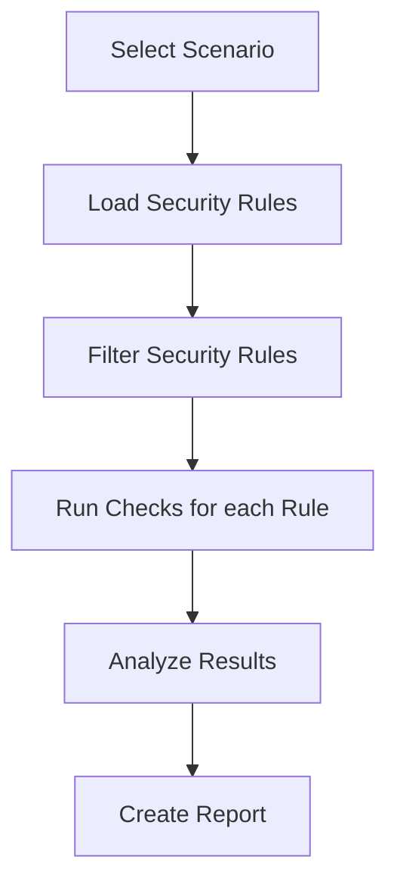

# Policy Inspector

Find out which firewall security policy is being shadowed and write
your own custom checks.

> [!CAUTION]
> Package is under active development. Things might and will change.


## What _Policy Inspector_ really is?

It is a CLI tool to run a analysis of provided firewall security
policies against a predefined series of checks
called [Scenarios](#scenarios).

It started as a tool to detect shadowing firewall rules. It evolved
into a small framework that allows to define different scenario very
easily.

> [!INFO]
> As of today, _Policy Inspector_ only supports security policies
> from Palo Alto Firewall (and Panorama).

## Installation

You can install using:

```shell
# pip
pip install policy_inspector

# poetry
poetry add policy_inspector

# pipx
pipx install policy_inspector
```

## Quick Start

To use Policy Inspector with Palo Alto firewalls, you'll first
need to export security rules. The simplest way to export security
rules is using `curl`. First, get API key:

```shell
# Linux
API_KEY=$(curl -k -s "https://<FIREWALL-IP>/api/?type=keygen&user=<USERNAME>&password=<PASSWORD>" | grep -o "<key>.*</key>" | sed -e 's/<key>//g' -e 's/<\/key>//g')

# Windows
$API_KEY = (Invoke-RestMethod -SkipCertificateCheck -Uri "https://<FIREWALL-IP>/api/?type=keygen&user=<USERNAME>&password=<PASSWORD>").response.result.key
```

Then export security rules:

```shell
# Linux
curl -k -o policies.xml "https://<FIREWALL-IP>/api/?type=config&action=show&key=$API_KEY&xpath=/config/devices/entry[@name='localhost.localdomain']/vsys/entry[@name='vsys1']/rulebase/security"

# Windows
Invoke-RestMethod -SkipCertificateCheck -Uri "https://<FIREWALL-IP>/api/?type=config&action=show&key=$API_KEY&xpath=/config/devices/entry[@name='localhost.localdomain']/vsys/entry[@name='vsys1']/rulebase/security" -OutFile policies.xml
```

> [!INFO]
> You may need to update the `xpath` to match your specific
> environment.

Once you have your security policies file, from the same directory,
run:

```shell
pi run shadowing policies.xml
```

## Usage

Once installed, you can run it using `policyinspector` or just `pi`
command:

```shell
pi --help
```

To list available scenarios:

```shell
pi list
```

To run scenario on your own firewall rules:

```shell
pi run shadowing policies.json
```

To see how it works for yourself, run scenario on example data:

```shell
pi run example shadowing
```

```shell
$ pi run example shadowing
Executing Shadowing scenario
Shadowed rules detection complete
Analyzing results...
[rule-example2] Rule is shadowed by: ['rule-example1']

```

## Scenarios

List of currently available scenarios.

### Shadowing

Identifies policies that will never be triggered because they're
completely hidden behind earlier rules in the processing order.
It checks if all these elements are covered by a preceding rule:

- Same action (allow/deny)
- Same or broader source and destination zones
- Same or broader source and destination addresses
- Same or broader applications
- Same or broader services (ports)

When **all conditions match**, the later rule is **flagged as
shadowed**.

### Shadowing by Value

Advanced version of [Shadowing](#shadowing). It analyze the
actual IP addresses behind Address Objects and Address Groups. This scenario identifies
shadowing at the precise IP subnet level by resolving Address's
name to actual IP address.

#### Requirements

This scenario needs three input files:

- Security rules file
- Address groups file
- Address objects file

## Details

### How does it work?

It's pretty straightforward.



### What _Scenarios_ is?

A scenario is a set of [checks](#what-_check_-is) that **evaluate firewall rules
against
specific issues or configurations**. Each scenario is designed to
identify particular problem, such as shadowing rules, rules without
logging, or other security policy issues.

### What _Check_ is?

A _check_ is simply a function. It takes security policy or policies
as an argument, assess whether the policies fulfill a check or not.

## Contribution & Development

If you'd like to contribute, follow these steps:

```shell
git clone https://github.com/Kanguros/policy_inspector
cd policy_inspector
poetry install --with=dev
pre-commit install --install-hooks
pre-commit run --all-files
```

Feel free to open issues or submit pull requests!
