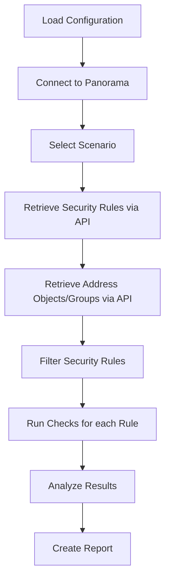

# **_pins_**

Find out which firewall security policy is being shadowed and write
your own custom checks.


## What _pins_ really is?

_pins_ is a CLI tool that connects directly to your Palo Alto Panorama to analyze
firewall security policies in real-time. It runs automated analysis against
predefined series of checks called [Scenarios](#scenarios).

Originally designed to detect shadowing firewall rules, it has evolved
into a comprehensive framework that allows you to define and execute
different security policy scenarios with ease.

**Key Capabilities:**

- **Direct Panorama Integration**: Connects via REST API for real-time analysis
- **Device Group Analysis**: Supports multiple device groups simultaneously
- **Advanced Shadowing Detection**: Identifies truly unreachable rules by resolving IP addresses
- **Extensible Framework**: Easy to add custom scenarios and checks
- **Multiple Output Formats**: Text, HTML, and JSON reporting

> [!NOTE] > _pins_ requires direct connectivity to Palo Alto Panorama and
> uses REST API for all data retrieval. No manual file exports needed.

## Installation

You can install using:

```shell
# pip
pip install pins

# poetry
poetry add pins

# pipx
pipx install pins
```

## Prerequisites

Before using _pins_, ensure you have:

- **Direct network access** to your Palo Alto Panorama instance
- **Valid credentials** with API access permissions
- **REST API enabled** on your Panorama (version 10.0 or higher recommended)

## Quick Start

_pins_ connects directly to your Palo Alto Panorama via REST API to analyze security policies in real-time.

### 1. Create Configuration File

Create a `config.yaml` file with your Panorama connection details:

```yaml
panorama:
    hostname: "your-panorama.company.com"
    username: "your-username"
    password: "your-password"
    api_version: "v11.1" # Optional, defaults to v11.1
    verify_ssl: false # Optional, defaults to false
```

### 2. Run Analysis

Execute shadowing analysis on your device groups:

```shell
# Analyze specific device groups
pins run shadowing --config-file config.yaml --device-groups "DG-Production" "DG-DMZ"

# Or use default config.yaml in current directory
pins run shadowing --device-groups "DG-Production"
```

### 3. Try Example Data

To see how _pins_ works without connecting to your environment:

```shell
pins run example shadowing-basic
```

## Usage

Once installed, you can run it using `pins` command:

```shell
pins
```

To list available scenarios:

```shell
pins list
```

To run analysis on your Panorama device groups:

```shell
# Basic shadowing analysis
pins run shadowing --device-groups "DG-Production" "DG-DMZ"

# Advanced shadowing analysis (resolves IP addresses)
pins run shadowingvalue --device-groups "DG-Production"

# Use custom config file
pins run shadowing --config-file /path/to/config.yaml --device-groups "DG-Production"
```

To see how it works with example data:

```shell
pins run example shadowing-basic
```

### Configuration Options

You can customize the analysis behavior in your `config.yaml`:

```yaml
panorama:
    hostname: "panorama.company.com"
    username: "api-user"
    password: "secure-password"
    api_version: "v11.1"
    verify_ssl: true

# Optional: Control output formats
show: ["text"] # Display results in terminal
export: ["html", "json"] # Export results to files
```

## Scenarios

List of currently available scenarios.

### Shadowing (`shadowing`)

Identifies policies that will never be triggered because they're
completely hidden behind earlier rules in the processing order.

It checks if all these elements are covered by a preceding rule:

- Same action (allow/deny)
- Same or broader source and destination zones
- Same or broader source and destination addresses
- Same or broader applications
- Same or broader services (ports)

When **all conditions match**, the later rule is **flagged as
shadowed**.

**Usage:**

```shell
pins run shadowing --device-groups "DG-Production"
```

### Advanced Shadowing (`shadowingvalue`)

Advanced version of [Shadowing](#shadowing). It analyzes the
actual IP addresses behind Address Objects and Address Groups.

It identifies shadowing at the precise IP subnet level by resolving Address
names to actual IP addresses, providing more accurate detection of truly
shadowed rules.

**Usage:**

```shell
pins run shadowingvalue --device-groups "DG-Production"
```

**Requirements:**

- Address Objects and Address Groups must be accessible via Panorama API
- Proper API permissions to read object configurations

## Details

### How does it work?

_pins_ connects directly to your Palo Alto Panorama and analyzes security policies in real-time.



**Key Features:**

- **Real-time Analysis**: Direct API connection to Panorama eliminates the need for manual file exports
- **Device Group Support**: Analyze multiple device groups simultaneously
- **Flexible Configuration**: YAML-based configuration with environment-specific settings
- **Multiple Output Formats**: Support for text, HTML, and JSON report formats

### What _Scenarios_ is?

A scenario is a set of [checks](#what-_check_-is) that **evaluate firewall rules
against specific issues or configurations**. Each scenario is
designed to identify particular problem, such as shadowing rules, rules without
logging, or other security policy issues.

### What _Check_ is?

A _check_ is simply a function. It takes security policy or policies
as an argument, assess whether the policies fulfill a check or not.

## Available Examples

You can explore _pins_ functionality with built-in examples:

```shell
# Basic shadowing scenario
pins run example shadowing-basic

# Multiple device groups scenario
pins run example shadowing-multiple-dg

# Advanced shadowing with IP resolution
pins run example shadowingvalue-basic
```

## Troubleshooting

### Common Issues

**Connection Errors:**

- Verify network connectivity to Panorama
- Check if REST API is enabled on Panorama
- Confirm API user has proper permissions

**Authentication Failures:**

- Verify username and password in config.yaml
- Ensure API user account is not locked
- Check if multi-factor authentication is disabled for API user

**No Rules Found:**

- Verify device group names are correct
- Check if the specified device groups contain security rules
- Ensure API user has read permissions for the device groups

### Configuration Tips

**For Production Use:**

```yaml
panorama:
    hostname: "panorama.company.com"
    username: "pins-api-user"
    password: "secure-password"
    verify_ssl: true # Enable SSL verification
    api_version: "v11.1"
```

**For Testing/Lab:**

```yaml
panorama:
    hostname: "lab-panorama.local"
    username: "admin"
    password: "admin"
    verify_ssl: false # Disable for self-signed certificates
```

## Output Formats

_pins_ supports multiple output formats:

- **Text**: Human-readable console output (default)
- **HTML**: Rich web-based reports with interactive elements
- **JSON**: Machine-readable format for integration with other tools

Configure output in your `config.yaml`:

```yaml
show: ["text"] # Console output
export: ["html", "json"] # File exports
```

## Contribution & Development

If you'd like to contribute, follow these steps:

```shell
git clone https://github.com/Kanguros/pins
cd pins
poetry install --with=dev
pre-commit install --install-hooks
pre-commit run --all-files
```

Feel free to open issues or submit pull requests!
