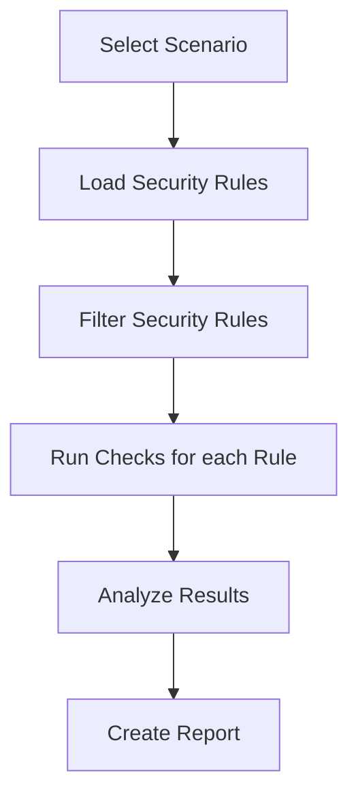

> [!CAUTION]
> Package is under active development. Things might and will change.


# Policy Inspector

Find out which firewall security policy is being shadowed and
write your own custom checks.

## What _Policy Inspector_ really is?

It is a CLI tool to run a analysis of provided firewall security
policies against a predefined series of checks called [Scenarios]
(#scenarios).

It started as a tool to detect shadowing firewall rules. It evolved
into a small framework that allows to define different scenario very
easily.

## Installation

You can install using:

### pip

```shell
# pip
pip install policy_inspector

# poetry
poetry add policy_inspector

# pipx
pipx install policy_inspector

```

## Usage

Once installed, you can run it using `policyinspector` or just `pi`
command:

```shell
pi --help
```

To check your own firewall rules:

```shell
pi run shadowing policies.json
```

To see how it works for yourself, run scenario on example data:

```shell
pi run example shadowing
```

```shell
$ pi run example shadowing
Executing Shadowing scenario
Shadowed rules detection complete
Analyzing results...
[rule-example2] Rule is shadowed by: ['rule-example1']

```

## Details

### How does it work?

It's pretty straightforward.

1. Get desire scenario.
2. Loads security policies from file.
3. Filter them to exclude unwanted policies.
4. Execute selected scenario's checks for each security policy.
5. Evaluate check's results.



### Scenarios

A scenario is a set of checks that evaluate firewall rules against
specific issues or configurations. Each scenario is designed to
identify particular problem.

### Checks

A _check_ is simply a function. It takes security policy or policies
as an argument, assess whether the policies fulfill a check or not.

## Contribution & Development

If you'd like to contribute, follow these steps:

```shell
git clone https://github.com/Kanguros/policy_inspector
cd policy_inspector
poetry install --with=dev
pre-commit install --install-hooks
pre-commit run --all-files
```

Feel free to open issues or submit pull requests!
