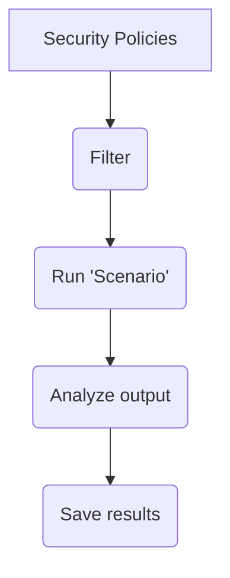

# Notes

## Flow

```mermaid
flowchart TB

    policies[Security Policies] --> filter(Filter)
    filter --> checklist(Run 'Scenario')
    checklist --> analyze(Analyze output)
    analyze --> save(Save results)

```
